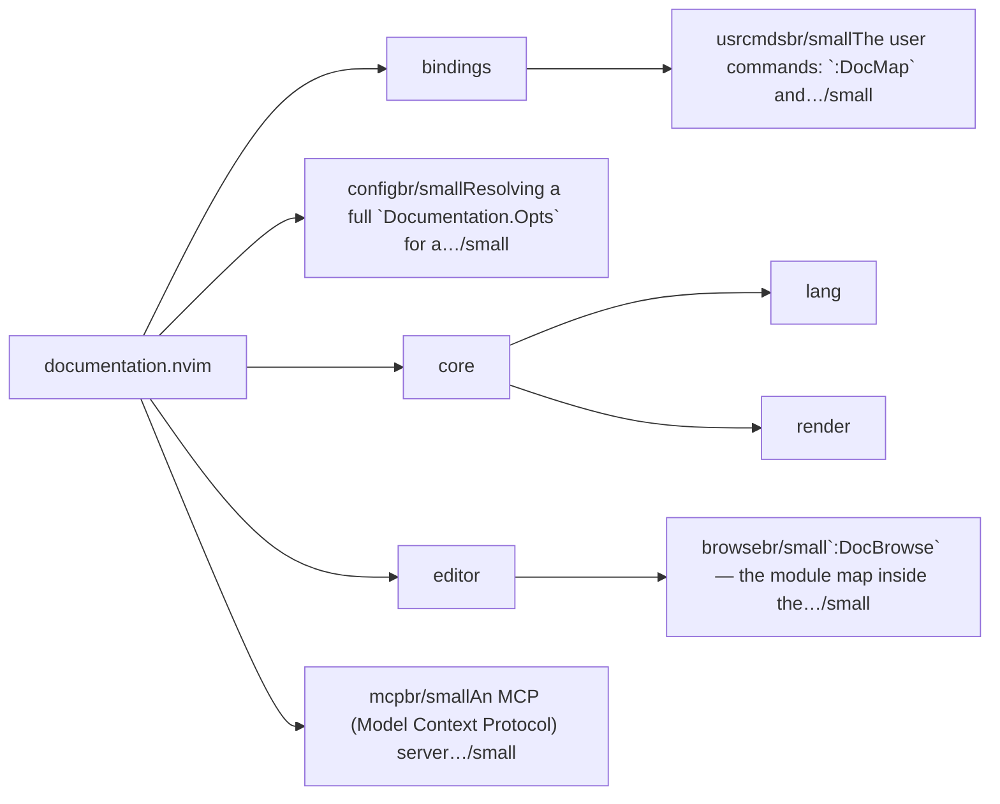

# documentation.nvim — module map

> **Generated** by `documentation`. Do not edit by hand — run `:DocMap`
> (or `nvim --headless -l scripts/gen_map.lua`) to regenerate.

**5 modules** · 6 namespaces · 119 helper files

The [interactive map](index.html) has filtering, full descriptions and
source links; this page is the version the code host renders directly.

## Namespaces

## Dependencies

Which parts of the tree require which, rolled up to the second level.
The [interactive map](index.html)'s **Deps** view has this per module,
in both directions, with load-time and lazy requires told apart.

```mermaid
flowchart LR
  nlua_documentation_bindings_autocmds_lua["documentation.bindings.autocmds"]
  nlua_documentation_bindings_diagnostics_lua["documentation.bindings.diagnostics"]
  nlua_documentation_bindings_docs_lua["documentation.bindings.docs"]
  nlua_documentation_bindings_keymaps_lua["documentation.bindings.keymaps"]
  nlua_documentation_bindings_progress_lua["documentation.bindings.progress"]
  nlua_documentation_bindings_usrcmds["documentation.bindings.usrcmds"]
  nlua_documentation_core_annotate_lua["documentation.core.annotate"]
  nlua_documentation_core_api_lua["documentation.core.api"]
  nlua_documentation_core_artifact_lua["documentation.core.artifact"]
  nlua_documentation_core_bindings_lua["documentation.core.bindings"]
  nlua_documentation_core_calls_lua["documentation.core.calls"]
  nlua_documentation_core_check_lua["documentation.core.check"]
  nlua_documentation_core_checklist_lua["documentation.core.checklist"]
  nlua_documentation_core_churn_lua["documentation.core.churn"]
  nlua_documentation_core_cli_lua["documentation.core.cli"]
  nlua_documentation_core_consumers_lua["documentation.core.consumers"]
  nlua_documentation_core_coverage_lua["documentation.core.coverage"]
  nlua_documentation_core_deps_lua["documentation.core.deps"]
  nlua_documentation_core_diff_lua["documentation.core.diff"]
  nlua_documentation_core_doccoverage_lua["documentation.core.doccoverage"]
  nlua_documentation_core_docs_lua["documentation.core.docs"]
  nlua_documentation_core_endpoint_coverage_lua["documentation.core.endpoint_coverage"]
  nlua_documentation_core_endpoints_lua["documentation.core.endpoints"]
  nlua_documentation_core_find_lua["documentation.core.find"]
  nlua_documentation_core_findings_lua["documentation.core.findings"]
  nlua_documentation_core_functions_lua["documentation.core.functions"]
  nlua_documentation_core_history_lua["documentation.core.history"]
  nlua_documentation_core_json_lua["documentation.core.json"]
  nlua_documentation_core_lang["lang"]
  nlua_documentation_core_lang_registry_lua["documentation.core.lang_registry"]
  nlua_documentation_core_loaded_diff_lua["documentation.core.loaded_diff"]
  nlua_documentation_core_markers_lua["documentation.core.markers"]
  nlua_documentation_core_plugins_lua["documentation.core.plugins"]
  nlua_documentation_core_quicks_lua["documentation.core.quicks"]
  nlua_documentation_core_render["render"]
  nlua_documentation_core_scan_lua["documentation.core.scan"]
  nlua_documentation_core_snippet_lua["documentation.core.snippet"]
  nlua_documentation_core_soft_require_lua["documentation.core.soft_require"]
  nlua_documentation_core_symbols_lua["documentation.core.symbols"]
  nlua_documentation_core_tagfiles_lua["documentation.core.tagfiles"]
  nlua_documentation_core_tags_lua["documentation.core.tags"]
  nlua_documentation_core_telemetry_join_lua["documentation.core.telemetry_join"]
  nlua_documentation_core_telemetry_self_lua["documentation.core.telemetry_self"]
  nlua_documentation_core_timing_lua["documentation.core.timing"]
  nlua_documentation_core_tools_lua["documentation.core.tools"]
  nlua_documentation_editor_browse["documentation.editor.browse"]
  nlua_documentation_editor_callhierarchy_lua["documentation.editor.callhierarchy"]
  nlua_documentation_editor_command_lua["documentation.editor.command"]
  nlua_documentation_editor_health_lua["documentation.editor.health"]
  nlua_documentation_editor_pick_lua["documentation.editor.pick"]
  nlua_documentation_editor_registry_lua["documentation.editor.registry"]
  nlua_documentation_editor_serve_lua["documentation.editor.serve"]
  nlua_documentation_mcp_protocol_lua["documentation.mcp.protocol"]
  nlua_documentation_mcp_tools_lua["documentation.mcp.tools"]
  nlua_documentation_bindings_autocmds_lua --> nlua_documentation_bindings_usrcmds
  nlua_documentation_bindings_diagnostics_lua --> nlua_documentation_core_findings_lua
  nlua_documentation_bindings_docs_lua --> nlua_documentation_bindings_autocmds_lua
  nlua_documentation_bindings_docs_lua --> nlua_documentation_editor_browse
  nlua_documentation_bindings_progress_lua --> nlua_documentation_core_soft_require_lua
  nlua_documentation_bindings_usrcmds --> nlua_documentation_bindings_progress_lua
  nlua_documentation_bindings_usrcmds --> nlua_documentation_core_annotate_lua
  nlua_documentation_bindings_usrcmds --> nlua_documentation_core_check_lua
  nlua_documentation_bindings_usrcmds --> nlua_documentation_core_checklist_lua
  nlua_documentation_bindings_usrcmds --> nlua_documentation_core_churn_lua
  nlua_documentation_bindings_usrcmds --> nlua_documentation_core_consumers_lua
  nlua_documentation_bindings_usrcmds --> nlua_documentation_core_deps_lua
  nlua_documentation_bindings_usrcmds --> nlua_documentation_core_diff_lua
  nlua_documentation_bindings_usrcmds --> nlua_documentation_core_find_lua
  nlua_documentation_bindings_usrcmds --> nlua_documentation_core_findings_lua
  nlua_documentation_bindings_usrcmds --> nlua_documentation_core_history_lua
  nlua_documentation_bindings_usrcmds --> nlua_documentation_core_telemetry_join_lua
  nlua_documentation_bindings_usrcmds --> nlua_documentation_core_telemetry_self_lua
  nlua_documentation_bindings_usrcmds --> nlua_documentation_core_timing_lua
  nlua_documentation_bindings_usrcmds --> nlua_documentation_editor_browse
  nlua_documentation_bindings_usrcmds --> nlua_documentation_editor_pick_lua
  nlua_documentation_bindings_usrcmds --> nlua_documentation_editor_registry_lua
  nlua_documentation_bindings_usrcmds --> nlua_documentation_editor_serve_lua
  nlua_documentation_core_annotate_lua --> nlua_documentation_core_check_lua
  nlua_documentation_core_api_lua --> nlua_documentation_core_artifact_lua
  nlua_documentation_core_api_lua --> nlua_documentation_core_checklist_lua
  nlua_documentation_core_api_lua --> nlua_documentation_core_history_lua
  nlua_documentation_core_api_lua --> nlua_documentation_core_loaded_diff_lua
  nlua_documentation_core_api_lua --> nlua_documentation_core_soft_require_lua
  nlua_documentation_core_api_lua --> nlua_documentation_core_telemetry_join_lua
  nlua_documentation_core_calls_lua --> nlua_documentation_core_deps_lua
  nlua_documentation_core_calls_lua --> nlua_documentation_core_lang_registry_lua
  nlua_documentation_core_check_lua --> nlua_documentation_core_consumers_lua
  nlua_documentation_core_check_lua --> nlua_documentation_core_deps_lua
  nlua_documentation_core_check_lua --> nlua_documentation_core_doccoverage_lua
  nlua_documentation_core_check_lua --> nlua_documentation_core_docs_lua
  nlua_documentation_core_check_lua --> nlua_documentation_core_lang_registry_lua
  nlua_documentation_core_check_lua --> nlua_documentation_core_telemetry_join_lua
  nlua_documentation_core_cli_lua --> nlua_documentation_core_coverage_lua
  nlua_documentation_core_cli_lua --> nlua_documentation_core_doccoverage_lua
  nlua_documentation_core_cli_lua --> nlua_documentation_core_findings_lua
  nlua_documentation_core_cli_lua --> nlua_documentation_core_lang_registry_lua
  nlua_documentation_core_cli_lua --> nlua_documentation_core_render
  nlua_documentation_core_cli_lua --> nlua_documentation_core_telemetry_join_lua
  nlua_documentation_core_consumers_lua --> nlua_documentation_core_artifact_lua
  nlua_documentation_core_deps_lua --> nlua_documentation_core_lang_registry_lua
  nlua_documentation_core_diff_lua --> nlua_documentation_core_check_lua
  nlua_documentation_core_diff_lua --> nlua_documentation_core_deps_lua
  nlua_documentation_core_doccoverage_lua --> nlua_documentation_core_check_lua
  nlua_documentation_core_doccoverage_lua --> nlua_documentation_core_lang_registry_lua
  nlua_documentation_core_doccoverage_lua --> nlua_documentation_core_render
  nlua_documentation_core_endpoint_coverage_lua --> nlua_documentation_core_soft_require_lua
  nlua_documentation_core_find_lua --> nlua_documentation_core_check_lua
  nlua_documentation_core_functions_lua --> nlua_documentation_core_bindings_lua
  nlua_documentation_core_functions_lua --> nlua_documentation_core_calls_lua
  nlua_documentation_core_functions_lua --> nlua_documentation_core_deps_lua
  nlua_documentation_core_functions_lua --> nlua_documentation_core_plugins_lua
  nlua_documentation_core_functions_lua --> nlua_documentation_core_scan_lua
  nlua_documentation_core_functions_lua --> nlua_documentation_core_snippet_lua
  nlua_documentation_core_functions_lua --> nlua_documentation_core_symbols_lua
  nlua_documentation_core_history_lua --> nlua_documentation_core_deps_lua
  nlua_documentation_core_lang --> nlua_documentation_core_endpoints_lua
  nlua_documentation_core_lang --> nlua_documentation_core_functions_lua
  nlua_documentation_core_lang --> nlua_documentation_core_lang_registry_lua
  nlua_documentation_core_lang --> nlua_documentation_core_scan_lua
  nlua_documentation_core_lang --> nlua_documentation_core_snippet_lua
  nlua_documentation_core_loaded_diff_lua --> nlua_documentation_core_check_lua
  nlua_documentation_core_loaded_diff_lua --> nlua_documentation_core_soft_require_lua
  nlua_documentation_core_quicks_lua --> nlua_documentation_core_doccoverage_lua
  nlua_documentation_core_render --> nlua_documentation_core_docs_lua
  nlua_documentation_core_render --> nlua_documentation_core_findings_lua
  nlua_documentation_core_render --> nlua_documentation_core_json_lua
  nlua_documentation_core_render --> nlua_documentation_core_lang_registry_lua
  nlua_documentation_core_render --> nlua_documentation_core_markers_lua
  nlua_documentation_core_render --> nlua_documentation_core_tags_lua
  nlua_documentation_core_scan_lua --> nlua_documentation_core_bindings_lua
  nlua_documentation_core_scan_lua --> nlua_documentation_core_calls_lua
  nlua_documentation_core_scan_lua --> nlua_documentation_core_deps_lua
  nlua_documentation_core_scan_lua --> nlua_documentation_core_lang_registry_lua
  nlua_documentation_core_scan_lua --> nlua_documentation_core_markers_lua
  nlua_documentation_core_scan_lua --> nlua_documentation_core_snippet_lua
  nlua_documentation_core_symbols_lua --> nlua_documentation_core_scan_lua
  nlua_documentation_core_tagfiles_lua --> nlua_documentation_core_find_lua
  nlua_documentation_core_telemetry_join_lua --> nlua_documentation_core_check_lua
  nlua_documentation_core_telemetry_join_lua --> nlua_documentation_core_doccoverage_lua
  nlua_documentation_core_telemetry_join_lua --> nlua_documentation_core_soft_require_lua
  nlua_documentation_core_telemetry_self_lua --> nlua_documentation_core_soft_require_lua
  nlua_documentation_core_tools_lua --> nlua_documentation_core_soft_require_lua
  nlua_documentation_editor_browse --> nlua_documentation_bindings_keymaps_lua
  nlua_documentation_editor_browse --> nlua_documentation_core_artifact_lua
  nlua_documentation_editor_browse --> nlua_documentation_core_check_lua
  nlua_documentation_editor_browse --> nlua_documentation_core_deps_lua
  nlua_documentation_editor_browse --> nlua_documentation_core_endpoint_coverage_lua
  nlua_documentation_editor_browse --> nlua_documentation_core_history_lua
  nlua_documentation_editor_browse --> nlua_documentation_core_loaded_diff_lua
  nlua_documentation_editor_browse --> nlua_documentation_core_soft_require_lua
  nlua_documentation_editor_browse --> nlua_documentation_core_telemetry_join_lua
  nlua_documentation_editor_browse --> nlua_documentation_editor_command_lua
  nlua_documentation_editor_browse --> nlua_documentation_editor_registry_lua
  nlua_documentation_editor_callhierarchy_lua --> nlua_documentation_core_telemetry_join_lua
  nlua_documentation_editor_command_lua --> nlua_documentation_bindings_usrcmds
  nlua_documentation_editor_command_lua --> nlua_documentation_core_find_lua
  nlua_documentation_editor_health_lua --> nlua_documentation_core_lang_registry_lua
  nlua_documentation_editor_health_lua --> nlua_documentation_core_soft_require_lua
  nlua_documentation_editor_pick_lua --> nlua_documentation_core_soft_require_lua
  nlua_documentation_editor_registry_lua --> nlua_documentation_bindings_diagnostics_lua
  nlua_documentation_editor_registry_lua --> nlua_documentation_core_render
  nlua_documentation_editor_registry_lua --> nlua_documentation_core_soft_require_lua
  nlua_documentation_editor_registry_lua --> nlua_documentation_core_telemetry_join_lua
  nlua_documentation_editor_registry_lua --> nlua_documentation_editor_callhierarchy_lua
  nlua_documentation_editor_serve_lua --> nlua_documentation_core_api_lua
  nlua_documentation_mcp_protocol_lua --> nlua_documentation_mcp_tools_lua
  nlua_documentation_mcp_tools_lua --> nlua_documentation_core_checklist_lua
  nlua_documentation_mcp_tools_lua --> nlua_documentation_core_findings_lua
  nlua_documentation_mcp_tools_lua --> nlua_documentation_core_json_lua
```

## Modules

| Module | Description | Fns | Docs |
|---|---|---|---|
| `bindings` |  |  |  |
| &nbsp;&nbsp;`documentation.bindings.usrcmds` | The user commands: `:DocMap` and `:DocBrowse` — registration, argument dispatch and completion. | 6 | [README](../../lua/documentation/bindings/usrcmds/README.md) · [src](../../lua/documentation/bindings/usrcmds/init.lua) |
| `documentation.config` | Resolving a full `Documentation.Opts` for a repository: the defaults in [`DEFAULTS.lua`](../../lua/documentation/config/DEFAULTS.lua), what can be derived from `root`, and the merge rule… | 6 | [README](../../lua/documentation/config/README.md) · [src](../../lua/documentation/config/init.lua) |
| `core` |  |  | [README](../../lua/documentation/core/README.md) |
| &nbsp;&nbsp;`lang` |  |  |  |
| &nbsp;&nbsp;&nbsp;&nbsp;`glossary` |  |  |  |
| &nbsp;&nbsp;`render` |  |  |  |
| `editor` |  |  | [README](../../lua/documentation/editor/README.md) |
| &nbsp;&nbsp;`documentation.editor.browse` | `:DocBrowse` — the module map inside the editor. | 38 | [README](../../lua/documentation/editor/browse/README.md) · [src](../../lua/documentation/editor/browse/init.lua) |
| `documentation.mcp` | An MCP (Model Context Protocol) server exposing this repository's module map to a coding agent. | 1 | [src](../../lua/documentation/mcp/init.lua) |

## Drift

0 errors · 0 warnings · 32 info

No errors or warnings.

32 informational findings

| Check | Message |
|---|---|
| `missing-readme` | lua/documentation/mcp has no README.md |
| `undocumented-param` | check_require_cycles has 2 parameter(s) but only 0 @param line(s) |
| `undocumented-param` | M.rank has 4 parameter(s) but only 3 @param line(s) |
| `undocumented-param` | complexity has 3 parameter(s) but only 2 @param line(s) |
| `undocumented-param` | build_fn has 6 parameter(s) but only 5 @param line(s) |
| `unreferenced-module` | documentation.bindings.docs is required by no other file in the tree |
| `unreferenced-module` | documentation.core.config is required by no other file in the tree |
| `unreferenced-module` | documentation.core.lang.asm is required by no other file in the tree |
| `unreferenced-module` | documentation.core.lang.c is required by no other file in the tree |
| `unreferenced-module` | documentation.core.lang.cpp is required by no other file in the tree |
| `unreferenced-module` | documentation.core.lang.csharp is required by no other file in the tree |
| `unreferenced-module` | documentation.core.lang.dart is required by no other file in the tree |
| `unreferenced-module` | documentation.core.lang.elixir is required by no other file in the tree |
| `unreferenced-module` | documentation.core.lang.erlang is required by no other file in the tree |
| `unreferenced-module` | documentation.core.lang.go is required by no other file in the tree |
| `unreferenced-module` | documentation.core.lang.haskell is required by no other file in the tree |
| `unreferenced-module` | documentation.core.lang.java is required by no other file in the tree |
| `unreferenced-module` | documentation.core.lang.js is required by no other file in the tree |
| `unreferenced-module` | documentation.core.lang.kotlin is required by no other file in the tree |
| `unreferenced-module` | documentation.core.lang.lua is required by no other file in the tree |
| `unreferenced-module` | documentation.core.lang.ocaml is required by no other file in the tree |
| `unreferenced-module` | documentation.core.lang.php is required by no other file in the tree |
| `unreferenced-module` | documentation.core.lang.python is required by no other file in the tree |
| `unreferenced-module` | documentation.core.lang.ruby is required by no other file in the tree |
| `unreferenced-module` | documentation.core.lang.rust is required by no other file in the tree |
| `unreferenced-module` | documentation.core.lang.scala is required by no other file in the tree |
| `unreferenced-module` | documentation.core.lang.swift is required by no other file in the tree |
| `unreferenced-module` | documentation.core.lang.ts is required by no other file in the tree |
| `unreferenced-module` | documentation.core.lang.tsx is required by no other file in the tree |
| `unreferenced-module` | documentation.core.lang.zig is required by no other file in the tree |
| `unreferenced-module` | documentation.editor.health is required by no other file in the tree |
| `unreferenced-module` | documentation.mcp is required by no other file in the tree |

