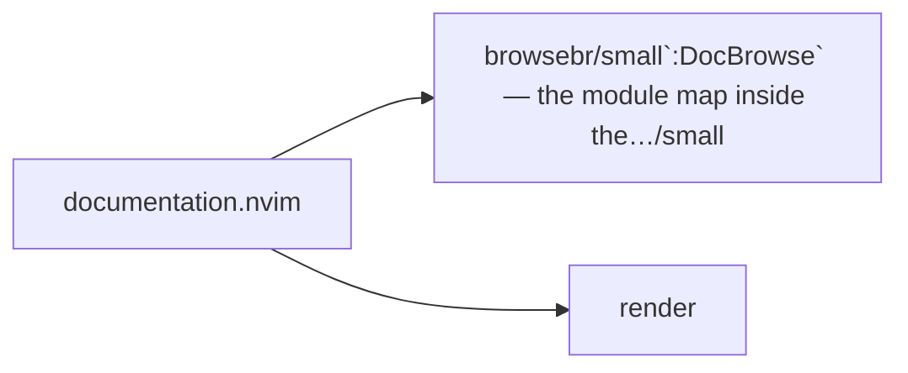
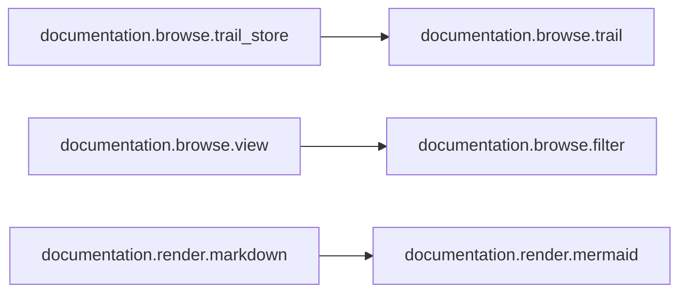

# documentation.nvim — module map

> **Generated** by `documentation`. Do not edit by hand — run `:DocMap`
> (or `nvim --headless -l scripts/gen_map.lua`) to regenerate.

**2 modules** · 1 namespaces · 30 helper files

The [interactive map](index.html) has filtering, full descriptions and
source links; this page is the version the code host renders directly.

## Namespaces

## Dependencies

Which parts of the tree require which, rolled up to the second level.
The [interactive map](index.html)'s **Deps** view has this per module,
in both directions, with load-time and lazy requires told apart.

## Modules

| Module | Description | Fns | Docs |
|---|---|---|---|
| `documentation.browse` | `:DocBrowse` — the module map inside the editor. | 34 | [README](../../lua/documentation/browse/README.md) · [src](../../lua/documentation/browse/init.lua) |
| `render` |  |  |  |

## Drift

0 errors · 0 warnings · 1 info

No errors or warnings.

1 informational findings

| Check | Message |
|---|---|
| `unreferenced-module` | documentation.health is required by no other file in the tree |

